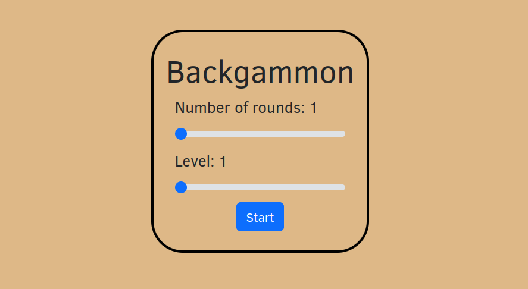

# Backgammon in kotlinjs

> The task is to implement a Backgammon game in KotlinJS. The application
would completely run on the client side and it would have a basic settings
page and a game page. The user plays against a very basic AI.
The game has a board with 12 pairs of triangles, and the goal of the game
for both players is to move their checkers to their home board, then off the
board.
The detailed rules can be read at https://www.bkgm.com/rules.html. Only the
simple rules are to be implemented (no doubling cubes and optional rules).


## Run

The kotlin-js project is run with the `browserProductionRun` gradle target. From the command line:
```bash
./gradlew :browserProductionRun
```
The tests are run using:
```bash
./gradlew :cleanBrowserTest :browserTest
```

## Game
The controls are very simple, first a start page pops up:  



After starting a game, the game screen is shown. A snapshot from a game is below:
 


## Remarks
- I tried to design according to the MVC pattern, where the `App` class implements the controller interface.
- The AI simply chooses a random legal move sequence. A real AI is planned to be run using a WebWorker,
 because this seems to be the only way to run it on a separate thread. For this, a separate `js` file would 
have to be compiled containing the worker's code.
- The board is implemented as an SVG element. This allows responsive rescaling of the board too without
image quality issues. The movement animations on the board use `setInterval` on the window, while other animations
are implemented in CSS (`animation.css`).