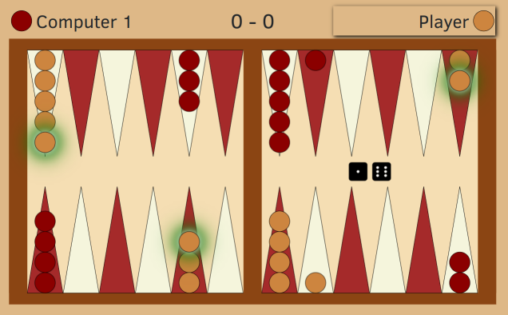

# backgammon-kotlinjs

A client-side backgammon game in the browser featuring:
- Game logics and frontend in Kotlin, compiled to JavaScript.
- Computer AI player using the Expecti-Minimax algorithm. The stronger levels use a neural net
  (TDGammon-like) exported in the [onnx](https://onnx.ai/) format using the
  [onnx js runtime](https://www.npmjs.com/package/onnxruntime-web).
- Rendering only using SVG objects and CSS styling.

**The game is hosted at: [https://regob.github.io/backgammon-kotlinjs/](https://regob.github.io/backgammon-kotlinjs/)**

---
## Backgammon
> Backgammon is a game of luck and skill played by two people with 15 checkers each on a board of 24 spaces or points. You move according to rolls of the dice, trying to bring your checkers home and bear them off before your opponent does. The strategy and fun come from blocking and hitting your opponent along the way.
>
> -- <cite><url>www.bkgm.com</url></cite>

The detailed rules can be read at https://www.bkgm.com/rules.html. Only the
simple rules are to be implemented -- no doubling cubes and optional rules.



---
## Run

The project is built with the `buildAll` gradle target. From the command line:
```bash
./gradlew :buildAll
```
The build command copies all the resources to `./docs`. The files can be served by an arbitrary web server,
e.g:
```bash
cd docs && python3 -m http.server
```

### Run tests
Building the project and running all the tests is possible using the `buildAndTestAll` target:
```bash
./gradlew buildAndTestAll
```
Running only the test targets is faster and provides a more readable output. The following runs the tests
for both the **worker** and the main **js** target:
```bash
./gradlew :cleanJsBrowserTest :jsBrowserTest :cleanWorkerBrowserTest :workerBrowserTest
```

---

## Notes
- The AI runs on a separate thread using a WebWorker, that's why the `worker.js` target is needed. 
- The neural net can be replaced by other `onnx` models, but if they use different input or output representations,
the adapter code needs to be modified accordingly. The current nets use the [TDGammon](https://www.scholarpedia.org/article/User:Gerald_Tesauro/Proposed/Td-gammon) 0.0 representation (198 input neurons).
- The nets were trained using the [gym-backgammon](https://github.com/regob/gym-backgammon) repo (which is a fork of [dellalibera/gym-backgammon](https://github.com/dellalibera/gym-backgammon)), and exported to onnx.